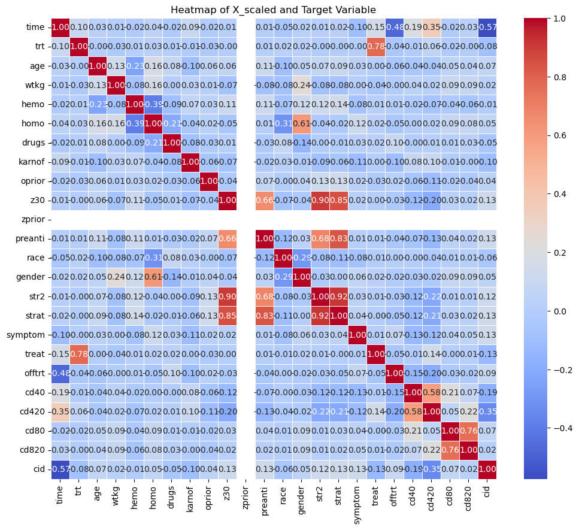

# AIDS Clinical Study Analysis
# Brashon Ford


## Local library import
We import all the required local libraries libraries


```python
pip install --upgrade --user nbconvert
```

    Requirement already satisfied: nbconvert in /Users/brashonford/anaconda3/lib/python3.11/site-packages (6.5.4)
    Collecting nbconvert
      Obtaining dependency information for nbconvert from https://files.pythonhosted.org/packages/f4/50/275525adbd3dcef9aee708b97f146a094c4f7f24c15c668a6e7cb4120181/nbconvert-7.14.2-py3-none-any.whl.metadata
      Downloading nbconvert-7.14.2-py3-none-any.whl.metadata (7.7 kB)
    Requirement already satisfied: beautifulsoup4 in /Users/brashonford/anaconda3/lib/python3.11/site-packages (from nbconvert) (4.12.2)
    Requirement already satisfied: bleach!=5.0.0 in /Users/brashonford/anaconda3/lib/python3.11/site-packages (from nbconvert) (4.1.0)
    Requirement already satisfied: defusedxml in /Users/brashonford/anaconda3/lib/python3.11/site-packages (from nbconvert) (0.7.1)
    Requirement already satisfied: jinja2>=3.0 in /Users/brashonford/anaconda3/lib/python3.11/site-packages (from nbconvert) (3.1.2)
    Requirement already satisfied: jupyter-core>=4.7 in /Users/brashonford/anaconda3/lib/python3.11/site-packages (from nbconvert) (5.3.0)
    Requirement already satisfied: jupyterlab-pygments in /Users/brashonford/anaconda3/lib/python3.11/site-packages (from nbconvert) (0.1.2)
    Requirement already satisfied: markupsafe>=2.0 in /Users/brashonford/anaconda3/lib/python3.11/site-packages (from nbconvert) (2.1.1)
    Collecting mistune<4,>=2.0.3 (from nbconvert)
      Obtaining dependency information for mistune<4,>=2.0.3 from https://files.pythonhosted.org/packages/f0/74/c95adcdf032956d9ef6c89a9b8a5152bf73915f8c633f3e3d88d06bd699c/mistune-3.0.2-py3-none-any.whl.metadata
      Downloading mistune-3.0.2-py3-none-any.whl.metadata (1.7 kB)
    Requirement already satisfied: nbclient>=0.5.0 in /Users/brashonford/anaconda3/lib/python3.11/site-packages (from nbconvert) (0.5.13)
    Requirement already satisfied: nbformat>=5.7 in /Users/brashonford/anaconda3/lib/python3.11/site-packages (from nbconvert) (5.7.0)
    Requirement already satisfied: packaging in /Users/brashonford/anaconda3/lib/python3.11/site-packages (from nbconvert) (23.0)
    Requirement already satisfied: pandocfilters>=1.4.1 in /Users/brashonford/anaconda3/lib/python3.11/site-packages (from nbconvert) (1.5.0)
    Requirement already satisfied: pygments>=2.4.1 in /Users/brashonford/anaconda3/lib/python3.11/site-packages (from nbconvert) (2.15.1)
    Requirement already satisfied: tinycss2 in /Users/brashonford/anaconda3/lib/python3.11/site-packages (from nbconvert) (1.2.1)
    Requirement already satisfied: traitlets>=5.1 in /Users/brashonford/anaconda3/lib/python3.11/site-packages (from nbconvert) (5.7.1)
    Requirement already satisfied: six>=1.9.0 in /Users/brashonford/anaconda3/lib/python3.11/site-packages (from bleach!=5.0.0->nbconvert) (1.16.0)
    Requirement already satisfied: webencodings in /Users/brashonford/anaconda3/lib/python3.11/site-packages (from bleach!=5.0.0->nbconvert) (0.5.1)
    Requirement already satisfied: platformdirs>=2.5 in /Users/brashonford/anaconda3/lib/python3.11/site-packages (from jupyter-core>=4.7->nbconvert) (2.5.2)
    Requirement already satisfied: jupyter-client>=6.1.5 in /Users/brashonford/anaconda3/lib/python3.11/site-packages (from nbclient>=0.5.0->nbconvert) (7.4.9)
    Requirement already satisfied: nest-asyncio in /Users/brashonford/anaconda3/lib/python3.11/site-packages (from nbclient>=0.5.0->nbconvert) (1.5.6)
    Requirement already satisfied: fastjsonschema in /Users/brashonford/anaconda3/lib/python3.11/site-packages (from nbformat>=5.7->nbconvert) (2.16.2)
    Requirement already satisfied: jsonschema>=2.6 in /Users/brashonford/anaconda3/lib/python3.11/site-packages (from nbformat>=5.7->nbconvert) (4.17.3)
    Requirement already satisfied: soupsieve>1.2 in /Users/brashonford/anaconda3/lib/python3.11/site-packages (from beautifulsoup4->nbconvert) (2.4)
    Requirement already satisfied: attrs>=17.4.0 in /Users/brashonford/anaconda3/lib/python3.11/site-packages (from jsonschema>=2.6->nbformat>=5.7->nbconvert) (22.1.0)
    Requirement already satisfied: pyrsistent!=0.17.0,!=0.17.1,!=0.17.2,>=0.14.0 in /Users/brashonford/anaconda3/lib/python3.11/site-packages (from jsonschema>=2.6->nbformat>=5.7->nbconvert) (0.18.0)
    Requirement already satisfied: entrypoints in /Users/brashonford/anaconda3/lib/python3.11/site-packages (from jupyter-client>=6.1.5->nbclient>=0.5.0->nbconvert) (0.4)
    Requirement already satisfied: python-dateutil>=2.8.2 in /Users/brashonford/anaconda3/lib/python3.11/site-packages (from jupyter-client>=6.1.5->nbclient>=0.5.0->nbconvert) (2.8.2)
    Requirement already satisfied: pyzmq>=23.0 in /Users/brashonford/anaconda3/lib/python3.11/site-packages (from jupyter-client>=6.1.5->nbclient>=0.5.0->nbconvert) (23.2.0)
    Requirement already satisfied: tornado>=6.2 in /Users/brashonford/anaconda3/lib/python3.11/site-packages (from jupyter-client>=6.1.5->nbclient>=0.5.0->nbconvert) (6.3.2)
    Downloading nbconvert-7.14.2-py3-none-any.whl (256 kB)
       ━━━━━━━━━━━━━━━━━━━━━━━━━━━━━━━━━━━━━━━━ 256.4/256.4 kB 8.6 MB/s eta 0:00:00
    [?25hDownloading mistune-3.0.2-py3-none-any.whl (47 kB)
       ━━━━━━━━━━━━━━━━━━━━━━━━━━━━━━━━━━━━━━━━ 48.0/48.0 kB 11.4 MB/s eta 0:00:00
    [?25hInstalling collected packages: mistune, nbconvert
      WARNING: The scripts jupyter-dejavu and jupyter-nbconvert are installed in '/Users/brashonford/.local/bin' which is not on PATH.
      Consider adding this directory to PATH or, if you prefer to suppress this warning, use --no-warn-script-location.
    ERROR: pip's dependency resolver does not currently take into account all the packages that are installed. This behaviour is the source of the following dependency conflicts.
    spyder 5.4.3 requires pyqt5<5.16, which is not installed.
    spyder 5.4.3 requires pyqtwebengine<5.16, which is not installed.
    Successfully installed mistune-3.0.2 nbconvert-7.14.2
    Note: you may need to restart the kernel to use updated packages.


```python
import pandas as pd
import matplotlib.pyplot as plt
import seaborn as sns
import numpy as np
%matplotlib inline
import pandas as pd
import numpy as np
import seaborn as sns
import matplotlib.pyplot as plt
from sklearn.preprocessing import StandardScaler
from sklearn.model_selection import train_test_split
from sklearn import metrics
from sklearn.linear_model import LinearRegression, LogisticRegression
from sklearn.pipeline import make_pipeline
```


```python
from scipy.spatial import distance_matrix
from sklearn.cluster import KMeans
from sklearn.cluster import KMeans
from sklearn.preprocessing import StandardScaler
import statsmodels.api as sm
import numpy as np
```


```python
pip install ucimlrepo
```

    Requirement already satisfied: ucimlrepo in /Users/brashonford/anaconda3/lib/python3.11/site-packages (0.0.3)
    Note: you may need to restart the kernel to use updated packages.


```python
from ucimlrepo import fetch_ucirepo 
  
# fetch dataset 
aids_clinical_trials_group_study_175 = fetch_ucirepo(id=890) 
  
# data (as pandas dataframes) 
X = pd.DataFrame(aids_clinical_trials_group_study_175.data.features)
y = pd.DataFrame(aids_clinical_trials_group_study_175.data.targets)
  
# metadata 
print(aids_clinical_trials_group_study_175.metadata) 
  
# variable information 
print(aids_clinical_trials_group_study_175.variables) 

```

    {'uci_id': 890, 'name': 'AIDS Clinical Trials Group Study 175', 'repository_url': 'https://archive.ics.uci.edu/dataset/890/aids+clinical+trials+group+study+175', 'data_url': 'https://archive.ics.uci.edu/static/public/890/data.csv', 'abstract': 'The AIDS Clinical Trials Group Study 175 Dataset contains healthcare statistics and categorical information about patients who have been diagnosed with AIDS. This dataset was initially published in 1996. The prediction task is to predict whether or not each patient died within a certain window of time or not. ', 'area': 'Health and Medicine', 'tasks': ['Classification', 'Regression'], 'characteristics': ['Tabular', 'Multivariate'], 'num_instances': 2139, 'num_features': 23, 'feature_types': ['Categorical', 'Integer'], 'demographics': ['Age', 'Sexual Orientation', 'Race', 'Gender'], 'target_col': ['cid'], 'index_col': ['pidnum'], 'has_missing_values': 'no', 'missing_values_symbol': None, 'year_of_dataset_creation': 1996, 'last_updated': 'Fri Nov 03 2023', 'dataset_doi': '10.24432/C5ZG8F', 'creators': ['S. Hammer', 'D. Katzenstein', 'M. Hughes', 'H. Gundacker', 'R. Schooley', 'R. Haubrich', 'W. K.', 'M. Lederman', 'J. Phair', 'M. Niu', 'M. Hirsch', 'T. Merigan'], 'intro_paper': {'title': 'A trial comparing nucleoside monotherapy with combination therapy in HIV-infected adults with CD4 cell counts from 200 to 500 per cubic millimeter. AIDS Clinical Trials Group Study 175 Study Team.', 'authors': 'S. Hammer, D. Katzenstein, M. Hughes, H. Gundacker, R. Schooley, R. Haubrich, W. K. Henry, M. Lederman, J. Phair, M. Niu, M. Hirsch, T. Merigan', 'published_in': 'New England Journal of Medicine', 'year': 1996, 'url': 'https://www.semanticscholar.org/paper/c7c401dd7d49ead07e70b299e422b27314589d2f', 'doi': None}, 'additional_info': {'summary': None, 'purpose': 'To examine the performance of two different types of AIDS treatments', 'funded_by': '- AIDS Clinical Trials Group of the National Institute of Allergy and Infectious Diseases\n- General Research Center units funded by the National Center for Research Resources', 'instances_represent': '- Health records\n- AIDS patients\n- US only', 'recommended_data_splits': 'Cross validation or a single train-test split could be used.', 'sensitive_data': '- Ethnicity (race)\n- Gender', 'preprocessing_description': 'No', 'variable_info': '- Personal information (age, weight, race, gender, sexual activity)\n- Medical history (hemophilia, history of IV drugs)\n- Treatment history (ZDV/non-ZDV treatment history)\n- Lab results (CD4/CD8 counts)', 'citation': None}, 'external_url': 'https://classic.clinicaltrials.gov/ct2/show/NCT00000625'}
           name     role        type         demographic  \
    0    pidnum       ID     Integer                None   
    1       cid   Target      Binary                None   
    2      time  Feature     Integer                None   
    3       trt  Feature     Integer                None   
    4       age  Feature     Integer                 Age   
    5      wtkg  Feature  Continuous                None   
    6      hemo  Feature      Binary                None   
    7      homo  Feature      Binary  Sexual Orientation   
    8     drugs  Feature      Binary                None   
    9    karnof  Feature     Integer                None   
    10   oprior  Feature      Binary                None   
    11      z30  Feature      Binary                None   
    12   zprior  Feature      Binary                None   
    13  preanti  Feature     Integer                None   
    14     race  Feature     Integer                Race   
    15   gender  Feature      Binary              Gender   
    16     str2  Feature      Binary                None   
    17    strat  Feature     Integer                None   
    18  symptom  Feature      Binary                None   
    19    treat  Feature      Binary                None   
    20   offtrt  Feature      Binary                None   
    21     cd40  Feature     Integer                None   
    22    cd420  Feature     Integer                None   
    23     cd80  Feature     Integer                None   
    24    cd820  Feature     Integer                None   
    
                                              description units missing_values  
    0                                          Patient ID  None             no  
    1    censoring indicator (1 = failure, 0 = censoring)  None             no  
    2                        time to failure or censoring  None             no  
    3   treatment indicator (0 = ZDV only; 1 = ZDV + d...  None             no  
    4                               age (yrs) at baseline  None             no  
    5                             weight (kg) at baseline  None             no  
    6                            hemophilia (0=no, 1=yes)  None             no  
    7                   homosexual activity (0=no, 1=yes)  None             no  
    8                history of IV drug use (0=no, 1=yes)  None             no  
    9               Karnofsky score (on a scale of 0-100)  None             no  
    10  Non-ZDV antiretroviral therapy pre-175 (0=no, ...  None             no  
    11      ZDV in the 30 days prior to 175 (0=no, 1=yes)  None             no  
    12                     ZDV prior to 175 (0=no, 1=yes)  None             no  
    13             # days pre-175 anti-retroviral therapy  None             no  
    14                        race (0=White, 1=non-white)  None             no  
    15                                  gender (0=F, 1=M)  None             no  
    16    antiretroviral history (0=naive, 1=experienced)  None             no  
    17  antiretroviral history stratification (1='Anti...  None             no  
    18            symptomatic indicator (0=asymp, 1=symp)  None             no  
    19         treatment indicator (0=ZDV only, 1=others)  None             no  
    20  indicator of off-trt before 96+/-5 weeks (0=no...  None             no  
    21                                    CD4 at baseline  None             no  
    22                                CD4 at 20+/-5 weeks  None             no  
    23                                    CD8 at baseline  None             no  
    24                                CD8 at 20+/-5 weeks  None             no  


```python
print(X.columns)
```

    Index(['time', 'trt', 'age', 'wtkg', 'hemo', 'homo', 'drugs', 'karnof',
           'oprior', 'z30', 'zprior', 'preanti', 'race', 'gender', 'str2', 'strat',
           'symptom', 'treat', 'offtrt', 'cd40', 'cd420', 'cd80', 'cd820'],
          dtype='object')


```python
print(y.columns)
```

    Index(['cid'], dtype='object')


# Regression 


```python
combined_data.head()
```


<div>
<style scoped>
    .dataframe tbody tr th:only-of-type {
        vertical-align: middle;
    }

    .dataframe tbody tr th {
        vertical-align: top;
    }

    .dataframe thead th {
        text-align: right;
    }
</style>
<table border="1" class="dataframe">
  <thead>
    <tr style="text-align: right;">
      <th></th>
      <th>time</th>
      <th>trt</th>
      <th>age</th>
      <th>wtkg</th>
      <th>hemo</th>
      <th>homo</th>
      <th>drugs</th>
      <th>karnof</th>
      <th>oprior</th>
      <th>z30</th>
      <th>...</th>
      <th>str2</th>
      <th>strat</th>
      <th>symptom</th>
      <th>treat</th>
      <th>offtrt</th>
      <th>cd40</th>
      <th>cd420</th>
      <th>cd80</th>
      <th>cd820</th>
      <th>cid</th>
    </tr>
  </thead>
  <tbody>
    <tr>
      <th>0</th>
      <td>948</td>
      <td>2</td>
      <td>48</td>
      <td>89.8128</td>
      <td>0</td>
      <td>0</td>
      <td>0</td>
      <td>100</td>
      <td>0</td>
      <td>0</td>
      <td>...</td>
      <td>0</td>
      <td>1</td>
      <td>0</td>
      <td>1</td>
      <td>0</td>
      <td>422</td>
      <td>477</td>
      <td>566</td>
      <td>324</td>
      <td>0</td>
    </tr>
    <tr>
      <th>1</th>
      <td>1002</td>
      <td>3</td>
      <td>61</td>
      <td>49.4424</td>
      <td>0</td>
      <td>0</td>
      <td>0</td>
      <td>90</td>
      <td>0</td>
      <td>1</td>
      <td>...</td>
      <td>1</td>
      <td>3</td>
      <td>0</td>
      <td>1</td>
      <td>0</td>
      <td>162</td>
      <td>218</td>
      <td>392</td>
      <td>564</td>
      <td>1</td>
    </tr>
    <tr>
      <th>2</th>
      <td>961</td>
      <td>3</td>
      <td>45</td>
      <td>88.4520</td>
      <td>0</td>
      <td>1</td>
      <td>1</td>
      <td>90</td>
      <td>0</td>
      <td>1</td>
      <td>...</td>
      <td>1</td>
      <td>3</td>
      <td>0</td>
      <td>1</td>
      <td>1</td>
      <td>326</td>
      <td>274</td>
      <td>2063</td>
      <td>1893</td>
      <td>0</td>
    </tr>
    <tr>
      <th>3</th>
      <td>1166</td>
      <td>3</td>
      <td>47</td>
      <td>85.2768</td>
      <td>0</td>
      <td>1</td>
      <td>0</td>
      <td>100</td>
      <td>0</td>
      <td>1</td>
      <td>...</td>
      <td>1</td>
      <td>3</td>
      <td>0</td>
      <td>1</td>
      <td>0</td>
      <td>287</td>
      <td>394</td>
      <td>1590</td>
      <td>966</td>
      <td>0</td>
    </tr>
    <tr>
      <th>4</th>
      <td>1090</td>
      <td>0</td>
      <td>43</td>
      <td>66.6792</td>
      <td>0</td>
      <td>1</td>
      <td>0</td>
      <td>100</td>
      <td>0</td>
      <td>1</td>
      <td>...</td>
      <td>1</td>
      <td>3</td>
      <td>0</td>
      <td>0</td>
      <td>0</td>
      <td>504</td>
      <td>353</td>
      <td>870</td>
      <td>782</td>
      <td>0</td>
    </tr>
  </tbody>
</table>
<p>5 rows × 24 columns</p>
</div>


```python
X_train, X_test, y_train, y_test = train_test_split(combined_data.drop('cid', axis=1), combined_data['cid'], test_size=0.2, random_state=42)
model = LinearRegression()

# Fit the model to the training data
model.fit(X_train, y_train)

# Predict the target variable on the test set
y_pred = model.predict(X_test)

# Evaluate the model
mse = mean_squared_error(y_test, y_pred)
print(f'Mean Squared Error: {mse}')

```

    Mean Squared Error: 0.10882556678401331


```python
from sklearn.model_selection import train_test_split
from sklearn.linear_model import LinearRegression
from sklearn.metrics import mean_squared_error


X_train, X_test, y_train, y_test = train_test_split(X, y, test_size=0.2, random_state=42)
model = LinearRegression()
model.fit(X_train, y_train)


y_pred = model.predict(X_test)


mse = mean_squared_error(y_test, y_pred)
print(f'Mean Squared Error: {mse}')

```

    Mean Squared Error: 0.10882556678401331


```python
summary_statistics = X.describe()
summary_statistics
```


<div>
<style scoped>
    .dataframe tbody tr th:only-of-type {
        vertical-align: middle;
    }

    .dataframe tbody tr th {
        vertical-align: top;
    }

    .dataframe thead th {
        text-align: right;
    }
</style>
<table border="1" class="dataframe">
  <thead>
    <tr style="text-align: right;">
      <th></th>
      <th>time</th>
      <th>trt</th>
      <th>age</th>
      <th>wtkg</th>
      <th>hemo</th>
      <th>homo</th>
      <th>drugs</th>
      <th>karnof</th>
      <th>oprior</th>
      <th>z30</th>
      <th>...</th>
      <th>gender</th>
      <th>str2</th>
      <th>strat</th>
      <th>symptom</th>
      <th>treat</th>
      <th>offtrt</th>
      <th>cd40</th>
      <th>cd420</th>
      <th>cd80</th>
      <th>cd820</th>
    </tr>
  </thead>
  <tbody>
    <tr>
      <th>count</th>
      <td>2139.000000</td>
      <td>2139.000000</td>
      <td>2139.000000</td>
      <td>2139.000000</td>
      <td>2139.000000</td>
      <td>2139.000000</td>
      <td>2139.000000</td>
      <td>2139.000000</td>
      <td>2139.000000</td>
      <td>2139.000000</td>
      <td>...</td>
      <td>2139.000000</td>
      <td>2139.000000</td>
      <td>2139.000000</td>
      <td>2139.000000</td>
      <td>2139.000000</td>
      <td>2139.000000</td>
      <td>2139.000000</td>
      <td>2139.000000</td>
      <td>2139.000000</td>
      <td>2139.000000</td>
    </tr>
    <tr>
      <th>mean</th>
      <td>879.098177</td>
      <td>1.520804</td>
      <td>35.248247</td>
      <td>75.125311</td>
      <td>0.084151</td>
      <td>0.661057</td>
      <td>0.131370</td>
      <td>95.446470</td>
      <td>0.021973</td>
      <td>0.550257</td>
      <td>...</td>
      <td>0.827957</td>
      <td>0.585788</td>
      <td>1.979897</td>
      <td>0.172978</td>
      <td>0.751286</td>
      <td>0.362786</td>
      <td>350.501169</td>
      <td>371.307153</td>
      <td>986.627396</td>
      <td>935.369799</td>
    </tr>
    <tr>
      <th>std</th>
      <td>292.274324</td>
      <td>1.127890</td>
      <td>8.709026</td>
      <td>13.263164</td>
      <td>0.277680</td>
      <td>0.473461</td>
      <td>0.337883</td>
      <td>5.900985</td>
      <td>0.146629</td>
      <td>0.497584</td>
      <td>...</td>
      <td>0.377506</td>
      <td>0.492701</td>
      <td>0.899053</td>
      <td>0.378317</td>
      <td>0.432369</td>
      <td>0.480916</td>
      <td>118.573863</td>
      <td>144.634909</td>
      <td>480.197750</td>
      <td>444.976051</td>
    </tr>
    <tr>
      <th>min</th>
      <td>14.000000</td>
      <td>0.000000</td>
      <td>12.000000</td>
      <td>31.000000</td>
      <td>0.000000</td>
      <td>0.000000</td>
      <td>0.000000</td>
      <td>70.000000</td>
      <td>0.000000</td>
      <td>0.000000</td>
      <td>...</td>
      <td>0.000000</td>
      <td>0.000000</td>
      <td>1.000000</td>
      <td>0.000000</td>
      <td>0.000000</td>
      <td>0.000000</td>
      <td>0.000000</td>
      <td>49.000000</td>
      <td>40.000000</td>
      <td>124.000000</td>
    </tr>
    <tr>
      <th>25%</th>
      <td>727.000000</td>
      <td>1.000000</td>
      <td>29.000000</td>
      <td>66.679200</td>
      <td>0.000000</td>
      <td>0.000000</td>
      <td>0.000000</td>
      <td>90.000000</td>
      <td>0.000000</td>
      <td>0.000000</td>
      <td>...</td>
      <td>1.000000</td>
      <td>0.000000</td>
      <td>1.000000</td>
      <td>0.000000</td>
      <td>1.000000</td>
      <td>0.000000</td>
      <td>263.500000</td>
      <td>269.000000</td>
      <td>654.000000</td>
      <td>631.500000</td>
    </tr>
    <tr>
      <th>50%</th>
      <td>997.000000</td>
      <td>2.000000</td>
      <td>34.000000</td>
      <td>74.390400</td>
      <td>0.000000</td>
      <td>1.000000</td>
      <td>0.000000</td>
      <td>100.000000</td>
      <td>0.000000</td>
      <td>1.000000</td>
      <td>...</td>
      <td>1.000000</td>
      <td>1.000000</td>
      <td>2.000000</td>
      <td>0.000000</td>
      <td>1.000000</td>
      <td>0.000000</td>
      <td>340.000000</td>
      <td>353.000000</td>
      <td>893.000000</td>
      <td>865.000000</td>
    </tr>
    <tr>
      <th>75%</th>
      <td>1091.000000</td>
      <td>3.000000</td>
      <td>40.000000</td>
      <td>82.555200</td>
      <td>0.000000</td>
      <td>1.000000</td>
      <td>0.000000</td>
      <td>100.000000</td>
      <td>0.000000</td>
      <td>1.000000</td>
      <td>...</td>
      <td>1.000000</td>
      <td>1.000000</td>
      <td>3.000000</td>
      <td>0.000000</td>
      <td>1.000000</td>
      <td>1.000000</td>
      <td>423.000000</td>
      <td>460.000000</td>
      <td>1207.000000</td>
      <td>1146.500000</td>
    </tr>
    <tr>
      <th>max</th>
      <td>1231.000000</td>
      <td>3.000000</td>
      <td>70.000000</td>
      <td>159.939360</td>
      <td>1.000000</td>
      <td>1.000000</td>
      <td>1.000000</td>
      <td>100.000000</td>
      <td>1.000000</td>
      <td>1.000000</td>
      <td>...</td>
      <td>1.000000</td>
      <td>1.000000</td>
      <td>3.000000</td>
      <td>1.000000</td>
      <td>1.000000</td>
      <td>1.000000</td>
      <td>1199.000000</td>
      <td>1119.000000</td>
      <td>5011.000000</td>
      <td>6035.000000</td>
    </tr>
  </tbody>
</table>
<p>8 rows × 23 columns</p>
</div>


```python
sns.regplot(x = 'age', y = 'cid', data = combined_data)
```


    <Axes: xlabel='age', ylabel='cid'>


    

    


# Classification Of Dataset


```python
from sklearn.model_selection import train_test_split
from sklearn.linear_model import LogisticRegression
from sklearn.metrics import accuracy_score, classification_report, confusion_matrix
from sklearn.cluster import KMeans
from sklearn.preprocessing import StandardScaler
import matplotlib.pyplot as plt
```


```python
from scipy.spatial import distance_matrix
from sklearn.cluster import KMeans
from sklearn.cluster import KMeans
from sklearn.preprocessing import StandardScaler
```


```python
import matplotlib.pyplot as plt
```

# Logistic Regression:


```python
scaler = StandardScaler()
X_train_scaled = scaler.fit_transform(X_train)
X_test_scaled = scaler.transform(X_test)

logreg_model = LogisticRegression(max_iter=1000)
logreg_model.fit(X_train_scaled, y_train)
```


<style>#sk-container-id-7 {color: black;}#sk-container-id-7 pre{padding: 0;}#sk-container-id-7 div.sk-toggleable {background-color: white;}#sk-container-id-7 label.sk-toggleable__label {cursor: pointer;display: block;width: 100%;margin-bottom: 0;padding: 0.3em;box-sizing: border-box;text-align: center;}#sk-container-id-7 label.sk-toggleable__label-arrow:before {content: "▸";float: left;margin-right: 0.25em;color: #696969;}#sk-container-id-7 label.sk-toggleable__label-arrow:hover:before {color: black;}#sk-container-id-7 div.sk-estimator:hover label.sk-toggleable__label-arrow:before {color: black;}#sk-container-id-7 div.sk-toggleable__content {max-height: 0;max-width: 0;overflow: hidden;text-align: left;background-color: #f0f8ff;}#sk-container-id-7 div.sk-toggleable__content pre {margin: 0.2em;color: black;border-radius: 0.25em;background-color: #f0f8ff;}#sk-container-id-7 input.sk-toggleable__control:checked~div.sk-toggleable__content {max-height: 200px;max-width: 100%;overflow: auto;}#sk-container-id-7 input.sk-toggleable__control:checked~label.sk-toggleable__label-arrow:before {content: "▾";}#sk-container-id-7 div.sk-estimator input.sk-toggleable__control:checked~label.sk-toggleable__label {background-color: #d4ebff;}#sk-container-id-7 div.sk-label input.sk-toggleable__control:checked~label.sk-toggleable__label {background-color: #d4ebff;}#sk-container-id-7 input.sk-hidden--visually {border: 0;clip: rect(1px 1px 1px 1px);clip: rect(1px, 1px, 1px, 1px);height: 1px;margin: -1px;overflow: hidden;padding: 0;position: absolute;width: 1px;}#sk-container-id-7 div.sk-estimator {font-family: monospace;background-color: #f0f8ff;border: 1px dotted black;border-radius: 0.25em;box-sizing: border-box;margin-bottom: 0.5em;}#sk-container-id-7 div.sk-estimator:hover {background-color: #d4ebff;}#sk-container-id-7 div.sk-parallel-item::after {content: "";width: 100%;border-bottom: 1px solid gray;flex-grow: 1;}#sk-container-id-7 div.sk-label:hover label.sk-toggleable__label {background-color: #d4ebff;}#sk-container-id-7 div.sk-serial::before {content: "";position: absolute;border-left: 1px solid gray;box-sizing: border-box;top: 0;bottom: 0;left: 50%;z-index: 0;}#sk-container-id-7 div.sk-serial {display: flex;flex-direction: column;align-items: center;background-color: white;padding-right: 0.2em;padding-left: 0.2em;position: relative;}#sk-container-id-7 div.sk-item {position: relative;z-index: 1;}#sk-container-id-7 div.sk-parallel {display: flex;align-items: stretch;justify-content: center;background-color: white;position: relative;}#sk-container-id-7 div.sk-item::before, #sk-container-id-7 div.sk-parallel-item::before {content: "";position: absolute;border-left: 1px solid gray;box-sizing: border-box;top: 0;bottom: 0;left: 50%;z-index: -1;}#sk-container-id-7 div.sk-parallel-item {display: flex;flex-direction: column;z-index: 1;position: relative;background-color: white;}#sk-container-id-7 div.sk-parallel-item:first-child::after {align-self: flex-end;width: 50%;}#sk-container-id-7 div.sk-parallel-item:last-child::after {align-self: flex-start;width: 50%;}#sk-container-id-7 div.sk-parallel-item:only-child::after {width: 0;}#sk-container-id-7 div.sk-dashed-wrapped {border: 1px dashed gray;margin: 0 0.4em 0.5em 0.4em;box-sizing: border-box;padding-bottom: 0.4em;background-color: white;}#sk-container-id-7 div.sk-label label {font-family: monospace;font-weight: bold;display: inline-block;line-height: 1.2em;}#sk-container-id-7 div.sk-label-container {text-align: center;}#sk-container-id-7 div.sk-container {/* jupyter's `normalize.less` sets `[hidden] { display: none; }` but bootstrap.min.css set `[hidden] { display: none !important; }` so we also need the `!important` here to be able to override the default hidden behavior on the sphinx rendered scikit-learn.org. See: https://github.com/scikit-learn/scikit-learn/issues/21755 */display: inline-block !important;position: relative;}#sk-container-id-7 div.sk-text-repr-fallback {display: none;}</style><div id="sk-container-id-7" class="sk-top-container"><div class="sk-text-repr-fallback"><pre>LogisticRegression(max_iter=1000)</pre><b>In a Jupyter environment, please rerun this cell to show the HTML representation or trust the notebook. <br />On GitHub, the HTML representation is unable to render, please try loading this page with nbviewer.org.</b></div><div class="sk-container" hidden><div class="sk-item"><div class="sk-estimator sk-toggleable"><input class="sk-toggleable__control sk-hidden--visually" id="sk-estimator-id-7" type="checkbox" checked><label for="sk-estimator-id-7" class="sk-toggleable__label sk-toggleable__label-arrow">LogisticRegression</label><div class="sk-toggleable__content"><pre>LogisticRegression(max_iter=1000)</pre></div></div></div></div></div>


```python
X_train, X_test, y_train, y_test = train_test_split(combined_data.drop(columns=['cid']), combined_data['cid'], test_size=0.2, random_state=42)


logreg_model = LogisticRegression()
logreg_model.fit(X_train, y_train)


y_pred = logreg_model.predict(X_test)


accuracy = accuracy_score(y_test, y_pred)
conf_matrix = confusion_matrix(y_test, y_pred)
classification_rep = classification_report(y_test, y_pred)

print(f'Accuracy: {accuracy}')
print(f'Confusion Matrix:\n{conf_matrix}')
print(f'Classification Report:\n{classification_rep}')
```

    Accuracy: 0.8294392523364486
    Confusion Matrix:
    [[306  21]
     [ 52  49]]
    Classification Report:
                  precision    recall  f1-score   support
    
               0       0.85      0.94      0.89       327
               1       0.70      0.49      0.57       101
    
        accuracy                           0.83       428
       macro avg       0.78      0.71      0.73       428
    weighted avg       0.82      0.83      0.82       428
    


    /Users/brashonford/anaconda3/lib/python3.11/site-packages/sklearn/linear_model/_logistic.py:460: ConvergenceWarning: lbfgs failed to converge (status=1):
    STOP: TOTAL NO. of ITERATIONS REACHED LIMIT.
    
    Increase the number of iterations (max_iter) or scale the data as shown in:
        https://scikit-learn.org/stable/modules/preprocessing.html
    Please also refer to the documentation for alternative solver options:
        https://scikit-learn.org/stable/modules/linear_model.html#logistic-regression
      n_iter_i = _check_optimize_result(


```python
X
```


<div>
<style scoped>
    .dataframe tbody tr th:only-of-type {
        vertical-align: middle;
    }

    .dataframe tbody tr th {
        vertical-align: top;
    }

    .dataframe thead th {
        text-align: right;
    }
</style>
<table border="1" class="dataframe">
  <thead>
    <tr style="text-align: right;">
      <th></th>
      <th>time</th>
      <th>trt</th>
      <th>age</th>
      <th>wtkg</th>
      <th>hemo</th>
      <th>homo</th>
      <th>drugs</th>
      <th>karnof</th>
      <th>oprior</th>
      <th>z30</th>
      <th>...</th>
      <th>gender</th>
      <th>str2</th>
      <th>strat</th>
      <th>symptom</th>
      <th>treat</th>
      <th>offtrt</th>
      <th>cd40</th>
      <th>cd420</th>
      <th>cd80</th>
      <th>cd820</th>
    </tr>
  </thead>
  <tbody>
    <tr>
      <th>0</th>
      <td>948</td>
      <td>2</td>
      <td>48</td>
      <td>89.8128</td>
      <td>0</td>
      <td>0</td>
      <td>0</td>
      <td>100</td>
      <td>0</td>
      <td>0</td>
      <td>...</td>
      <td>0</td>
      <td>0</td>
      <td>1</td>
      <td>0</td>
      <td>1</td>
      <td>0</td>
      <td>422</td>
      <td>477</td>
      <td>566</td>
      <td>324</td>
    </tr>
    <tr>
      <th>1</th>
      <td>1002</td>
      <td>3</td>
      <td>61</td>
      <td>49.4424</td>
      <td>0</td>
      <td>0</td>
      <td>0</td>
      <td>90</td>
      <td>0</td>
      <td>1</td>
      <td>...</td>
      <td>0</td>
      <td>1</td>
      <td>3</td>
      <td>0</td>
      <td>1</td>
      <td>0</td>
      <td>162</td>
      <td>218</td>
      <td>392</td>
      <td>564</td>
    </tr>
    <tr>
      <th>2</th>
      <td>961</td>
      <td>3</td>
      <td>45</td>
      <td>88.4520</td>
      <td>0</td>
      <td>1</td>
      <td>1</td>
      <td>90</td>
      <td>0</td>
      <td>1</td>
      <td>...</td>
      <td>1</td>
      <td>1</td>
      <td>3</td>
      <td>0</td>
      <td>1</td>
      <td>1</td>
      <td>326</td>
      <td>274</td>
      <td>2063</td>
      <td>1893</td>
    </tr>
    <tr>
      <th>3</th>
      <td>1166</td>
      <td>3</td>
      <td>47</td>
      <td>85.2768</td>
      <td>0</td>
      <td>1</td>
      <td>0</td>
      <td>100</td>
      <td>0</td>
      <td>1</td>
      <td>...</td>
      <td>1</td>
      <td>1</td>
      <td>3</td>
      <td>0</td>
      <td>1</td>
      <td>0</td>
      <td>287</td>
      <td>394</td>
      <td>1590</td>
      <td>966</td>
    </tr>
    <tr>
      <th>4</th>
      <td>1090</td>
      <td>0</td>
      <td>43</td>
      <td>66.6792</td>
      <td>0</td>
      <td>1</td>
      <td>0</td>
      <td>100</td>
      <td>0</td>
      <td>1</td>
      <td>...</td>
      <td>1</td>
      <td>1</td>
      <td>3</td>
      <td>0</td>
      <td>0</td>
      <td>0</td>
      <td>504</td>
      <td>353</td>
      <td>870</td>
      <td>782</td>
    </tr>
    <tr>
      <th>...</th>
      <td>...</td>
      <td>...</td>
      <td>...</td>
      <td>...</td>
      <td>...</td>
      <td>...</td>
      <td>...</td>
      <td>...</td>
      <td>...</td>
      <td>...</td>
      <td>...</td>
      <td>...</td>
      <td>...</td>
      <td>...</td>
      <td>...</td>
      <td>...</td>
      <td>...</td>
      <td>...</td>
      <td>...</td>
      <td>...</td>
      <td>...</td>
    </tr>
    <tr>
      <th>2134</th>
      <td>1091</td>
      <td>3</td>
      <td>21</td>
      <td>53.2980</td>
      <td>1</td>
      <td>0</td>
      <td>0</td>
      <td>100</td>
      <td>0</td>
      <td>1</td>
      <td>...</td>
      <td>1</td>
      <td>1</td>
      <td>3</td>
      <td>0</td>
      <td>1</td>
      <td>1</td>
      <td>152</td>
      <td>109</td>
      <td>561</td>
      <td>720</td>
    </tr>
    <tr>
      <th>2135</th>
      <td>395</td>
      <td>0</td>
      <td>17</td>
      <td>102.9672</td>
      <td>1</td>
      <td>0</td>
      <td>0</td>
      <td>100</td>
      <td>0</td>
      <td>1</td>
      <td>...</td>
      <td>1</td>
      <td>1</td>
      <td>3</td>
      <td>0</td>
      <td>0</td>
      <td>1</td>
      <td>373</td>
      <td>218</td>
      <td>1759</td>
      <td>1030</td>
    </tr>
    <tr>
      <th>2136</th>
      <td>1104</td>
      <td>2</td>
      <td>53</td>
      <td>69.8544</td>
      <td>1</td>
      <td>1</td>
      <td>0</td>
      <td>90</td>
      <td>0</td>
      <td>1</td>
      <td>...</td>
      <td>1</td>
      <td>1</td>
      <td>3</td>
      <td>0</td>
      <td>1</td>
      <td>0</td>
      <td>419</td>
      <td>364</td>
      <td>1391</td>
      <td>1041</td>
    </tr>
    <tr>
      <th>2137</th>
      <td>465</td>
      <td>0</td>
      <td>14</td>
      <td>60.0000</td>
      <td>1</td>
      <td>0</td>
      <td>0</td>
      <td>100</td>
      <td>0</td>
      <td>0</td>
      <td>...</td>
      <td>1</td>
      <td>0</td>
      <td>1</td>
      <td>0</td>
      <td>0</td>
      <td>0</td>
      <td>166</td>
      <td>169</td>
      <td>999</td>
      <td>1838</td>
    </tr>
    <tr>
      <th>2138</th>
      <td>1045</td>
      <td>3</td>
      <td>45</td>
      <td>77.3000</td>
      <td>1</td>
      <td>0</td>
      <td>0</td>
      <td>100</td>
      <td>0</td>
      <td>0</td>
      <td>...</td>
      <td>1</td>
      <td>0</td>
      <td>1</td>
      <td>0</td>
      <td>1</td>
      <td>0</td>
      <td>911</td>
      <td>930</td>
      <td>885</td>
      <td>526</td>
    </tr>
  </tbody>
</table>
<p>2139 rows × 23 columns</p>
</div>


```python
X_scaled
```


<div>
<style scoped>
    .dataframe tbody tr th:only-of-type {
        vertical-align: middle;
    }

    .dataframe tbody tr th {
        vertical-align: top;
    }

    .dataframe thead th {
        text-align: right;
    }
</style>
<table border="1" class="dataframe">
  <thead>
    <tr style="text-align: right;">
      <th></th>
      <th>time</th>
      <th>trt</th>
      <th>age</th>
      <th>wtkg</th>
      <th>hemo</th>
      <th>homo</th>
      <th>drugs</th>
      <th>karnof</th>
      <th>oprior</th>
      <th>z30</th>
      <th>...</th>
      <th>gender</th>
      <th>str2</th>
      <th>strat</th>
      <th>symptom</th>
      <th>treat</th>
      <th>offtrt</th>
      <th>cd40</th>
      <th>cd420</th>
      <th>cd80</th>
      <th>cd820</th>
    </tr>
  </thead>
  <tbody>
    <tr>
      <th>0</th>
      <td>0.235799</td>
      <td>0.424960</td>
      <td>1.464542</td>
      <td>1.107649</td>
      <td>-0.303123</td>
      <td>-1.396547</td>
      <td>-0.388893</td>
      <td>0.771836</td>
      <td>-0.149888</td>
      <td>-1.106116</td>
      <td>...</td>
      <td>-2.193741</td>
      <td>-1.189210</td>
      <td>-1.090177</td>
      <td>-0.457338</td>
      <td>0.575371</td>
      <td>-0.754541</td>
      <td>0.603131</td>
      <td>0.730927</td>
      <td>-0.876151</td>
      <td>-1.374260</td>
    </tr>
    <tr>
      <th>1</th>
      <td>0.420600</td>
      <td>1.311779</td>
      <td>2.957595</td>
      <td>-1.936862</td>
      <td>-0.303123</td>
      <td>-1.396547</td>
      <td>-0.388893</td>
      <td>-0.923192</td>
      <td>-0.149888</td>
      <td>0.904064</td>
      <td>...</td>
      <td>-2.193741</td>
      <td>0.840894</td>
      <td>1.134907</td>
      <td>-0.457338</td>
      <td>0.575371</td>
      <td>-0.754541</td>
      <td>-1.590108</td>
      <td>-1.060207</td>
      <td>-1.238586</td>
      <td>-0.834779</td>
    </tr>
    <tr>
      <th>2</th>
      <td>0.280288</td>
      <td>1.311779</td>
      <td>1.119991</td>
      <td>1.005025</td>
      <td>-0.303123</td>
      <td>0.716052</td>
      <td>2.571400</td>
      <td>-0.923192</td>
      <td>-0.149888</td>
      <td>0.904064</td>
      <td>...</td>
      <td>0.455842</td>
      <td>0.840894</td>
      <td>1.134907</td>
      <td>-0.457338</td>
      <td>0.575371</td>
      <td>1.325309</td>
      <td>-0.206680</td>
      <td>-0.672935</td>
      <td>2.242044</td>
      <td>2.152597</td>
    </tr>
    <tr>
      <th>3</th>
      <td>0.981848</td>
      <td>1.311779</td>
      <td>1.349692</td>
      <td>0.765569</td>
      <td>-0.303123</td>
      <td>0.716052</td>
      <td>-0.388893</td>
      <td>0.771836</td>
      <td>-0.149888</td>
      <td>0.904064</td>
      <td>...</td>
      <td>0.455842</td>
      <td>0.840894</td>
      <td>1.134907</td>
      <td>-0.457338</td>
      <td>0.575371</td>
      <td>-0.754541</td>
      <td>-0.535666</td>
      <td>0.156934</td>
      <td>1.256802</td>
      <td>0.068852</td>
    </tr>
    <tr>
      <th>4</th>
      <td>0.721757</td>
      <td>-1.348678</td>
      <td>0.890291</td>
      <td>-0.636959</td>
      <td>-0.303123</td>
      <td>0.716052</td>
      <td>-0.388893</td>
      <td>0.771836</td>
      <td>-0.149888</td>
      <td>0.904064</td>
      <td>...</td>
      <td>0.455842</td>
      <td>0.840894</td>
      <td>1.134907</td>
      <td>-0.457338</td>
      <td>-1.738009</td>
      <td>-0.754541</td>
      <td>1.294845</td>
      <td>-0.126605</td>
      <td>-0.242930</td>
      <td>-0.344750</td>
    </tr>
    <tr>
      <th>...</th>
      <td>...</td>
      <td>...</td>
      <td>...</td>
      <td>...</td>
      <td>...</td>
      <td>...</td>
      <td>...</td>
      <td>...</td>
      <td>...</td>
      <td>...</td>
      <td>...</td>
      <td>...</td>
      <td>...</td>
      <td>...</td>
      <td>...</td>
      <td>...</td>
      <td>...</td>
      <td>...</td>
      <td>...</td>
      <td>...</td>
      <td>...</td>
    </tr>
    <tr>
      <th>2134</th>
      <td>0.725180</td>
      <td>1.311779</td>
      <td>-1.636415</td>
      <td>-1.646094</td>
      <td>3.298990</td>
      <td>-1.396547</td>
      <td>-0.388893</td>
      <td>0.771836</td>
      <td>-0.149888</td>
      <td>0.904064</td>
      <td>...</td>
      <td>0.455842</td>
      <td>0.840894</td>
      <td>1.134907</td>
      <td>-0.457338</td>
      <td>0.575371</td>
      <td>1.325309</td>
      <td>-1.674463</td>
      <td>-1.814005</td>
      <td>-0.886566</td>
      <td>-0.484116</td>
    </tr>
    <tr>
      <th>2135</th>
      <td>-1.656702</td>
      <td>-1.348678</td>
      <td>-2.095816</td>
      <td>2.099680</td>
      <td>3.298990</td>
      <td>-1.396547</td>
      <td>-0.388893</td>
      <td>0.771836</td>
      <td>-0.149888</td>
      <td>0.904064</td>
      <td>...</td>
      <td>0.455842</td>
      <td>0.840894</td>
      <td>1.134907</td>
      <td>-0.457338</td>
      <td>-1.738009</td>
      <td>1.325309</td>
      <td>0.189790</td>
      <td>-1.060207</td>
      <td>1.608823</td>
      <td>0.212713</td>
    </tr>
    <tr>
      <th>2136</th>
      <td>0.769669</td>
      <td>0.424960</td>
      <td>2.038793</td>
      <td>-0.397503</td>
      <td>3.298990</td>
      <td>0.716052</td>
      <td>-0.388893</td>
      <td>-0.923192</td>
      <td>-0.149888</td>
      <td>0.904064</td>
      <td>...</td>
      <td>0.455842</td>
      <td>0.840894</td>
      <td>1.134907</td>
      <td>-0.457338</td>
      <td>0.575371</td>
      <td>-0.754541</td>
      <td>0.577824</td>
      <td>-0.050533</td>
      <td>0.842293</td>
      <td>0.237440</td>
    </tr>
    <tr>
      <th>2137</th>
      <td>-1.417145</td>
      <td>-1.348678</td>
      <td>-2.440366</td>
      <td>-1.140667</td>
      <td>3.298990</td>
      <td>-1.396547</td>
      <td>-0.388893</td>
      <td>0.771836</td>
      <td>-0.149888</td>
      <td>-1.106116</td>
      <td>...</td>
      <td>0.455842</td>
      <td>-1.189210</td>
      <td>-1.090177</td>
      <td>-0.457338</td>
      <td>-1.738009</td>
      <td>-0.754541</td>
      <td>-1.556366</td>
      <td>-1.399071</td>
      <td>0.025772</td>
      <td>2.028966</td>
    </tr>
    <tr>
      <th>2138</th>
      <td>0.567756</td>
      <td>1.311779</td>
      <td>1.119991</td>
      <td>0.164003</td>
      <td>3.298990</td>
      <td>-1.396547</td>
      <td>-0.388893</td>
      <td>0.771836</td>
      <td>-0.149888</td>
      <td>-1.106116</td>
      <td>...</td>
      <td>0.455842</td>
      <td>-1.189210</td>
      <td>-1.090177</td>
      <td>-0.457338</td>
      <td>0.575371</td>
      <td>-0.754541</td>
      <td>4.728107</td>
      <td>3.863683</td>
      <td>-0.211686</td>
      <td>-0.920197</td>
    </tr>
  </tbody>
</table>
<p>2139 rows × 23 columns</p>
</div>


```python
correlation_matrix = combined_data.corr()

print(correlation_matrix)
```

                 time       trt       age      wtkg      hemo      homo     drugs  \
    time     1.000000  0.101482  0.026544  0.009225 -0.017501  0.043430 -0.021856   
    trt      0.101482  1.000000 -0.001931 -0.031685  0.012329  0.025035  0.005712   
    age      0.026544 -0.001931  1.000000  0.132858 -0.231257  0.158917  0.077446   
    wtkg     0.009225 -0.031685  0.132858  1.000000 -0.075791  0.155909  0.002343   
    hemo    -0.017501  0.012329 -0.231257 -0.075791  1.000000 -0.391307 -0.092957   
    homo     0.043430  0.025035  0.158917  0.155909 -0.391307  1.000000 -0.206876   
    drugs   -0.021856  0.005712  0.077446  0.002343 -0.092957 -0.206876  1.000000   
    karnof   0.094417 -0.014573 -0.100041  0.034271  0.068403 -0.042072 -0.084558   
    oprior  -0.016116 -0.026805  0.056161  0.009607  0.034978  0.019743 -0.029968   
    z30      0.012898 -0.001656  0.061178 -0.073841  0.111554 -0.049760  0.014961   
    zprior        NaN       NaN       NaN       NaN       NaN       NaN       NaN   
    preanti  0.007249  0.006710  0.113220 -0.079292  0.113892  0.014132 -0.029981   
    race    -0.051276  0.017080 -0.097678 -0.081452 -0.070333 -0.307108  0.082311   
    gender   0.020810  0.022691  0.048705  0.240013  0.115867  0.607820 -0.141748   
    str2     0.010098 -0.003003  0.068230 -0.078885  0.124983 -0.036700  0.001106   
    strat    0.022033 -0.003508  0.089884 -0.080458  0.141674 -0.022608 -0.011319   
    symptom -0.104611 -0.000765  0.032814  0.003942 -0.076296  0.118575  0.027052   
    treat    0.153314  0.775990  0.001499 -0.040638  0.010786  0.024407  0.022055   
    offtrt  -0.475795 -0.043239 -0.057695 -0.003159  0.005949 -0.045151  0.098031   
    cd40     0.191436 -0.012770 -0.040302  0.036401 -0.022533  0.000511 -0.003360   
    cd420    0.350611  0.064448 -0.044294  0.020980 -0.065838  0.019915  0.013109   
    cd80    -0.017425 -0.015665  0.046874  0.090075 -0.037273  0.086028  0.014900   
    cd820    0.032480 -0.004595  0.037458  0.085447 -0.058392  0.082284  0.025728   
    cid     -0.574989 -0.084360  0.070384  0.016205 -0.011154  0.054279 -0.049794   
    
               karnof    oprior       z30  ...      str2     strat   symptom  \
    time     0.094417 -0.016116  0.012898  ...  0.010098  0.022033 -0.104611   
    trt     -0.014573 -0.026805 -0.001656  ... -0.003003 -0.003508 -0.000765   
    age     -0.100041  0.056161  0.061178  ...  0.068230  0.089884  0.032814   
    wtkg     0.034271  0.009607 -0.073841  ... -0.078885 -0.080458  0.003942   
    hemo     0.068403  0.034978  0.111554  ...  0.124983  0.141674 -0.076296   
    homo    -0.042072  0.019743 -0.049760  ... -0.036700 -0.022608  0.118575   
    drugs   -0.084558 -0.029968  0.014961  ...  0.001106 -0.011319  0.027052   
    karnof   1.000000 -0.057291 -0.074947  ... -0.085975 -0.055172 -0.107940   
    oprior  -0.057291  1.000000 -0.037580  ...  0.126040  0.134629  0.024199   
    z30     -0.074947 -0.037580  1.000000  ...  0.903417  0.848624  0.020883   
    zprior        NaN       NaN       NaN  ...       NaN       NaN       NaN   
    preanti -0.023189  0.067082  0.655054  ...  0.680354  0.833213  0.012304   
    race     0.026155 -0.003923 -0.073658  ... -0.080510 -0.106307 -0.078378   
    gender  -0.011695  0.042976 -0.036119  ... -0.031258  0.003586  0.064373   
    str2    -0.085975  0.126040  0.903417  ...  1.000000  0.916723  0.030760   
    strat   -0.055172  0.134629  0.848624  ...  0.916723  1.000000  0.041857   
    symptom -0.107940  0.024199  0.020883  ...  0.030760  0.041857  1.000000   
    treat    0.001379 -0.031801  0.003776  ...  0.005794 -0.000836  0.008648   
    offtrt  -0.103251  0.019561 -0.029318  ... -0.026789 -0.051276  0.071388   
    cd40     0.077730 -0.059199 -0.121282  ... -0.124566 -0.121317 -0.131006   
    cd420    0.098463 -0.109643 -0.200149  ... -0.216457 -0.206306 -0.124883   
    cd80    -0.008567 -0.019247  0.029346  ...  0.009576  0.032360  0.035311   
    cd820   -0.003981 -0.036577  0.018454  ...  0.012055  0.021257  0.049254   
    cid     -0.102944  0.041251  0.125488  ...  0.123390  0.131441  0.129234   
    
                treat    offtrt      cd40     cd420      cd80     cd820       cid  
    time     0.153314 -0.475795  0.191436  0.350611 -0.017425  0.032480 -0.574989  
    trt      0.775990 -0.043239 -0.012770  0.064448 -0.015665 -0.004595 -0.084360  
    age      0.001499 -0.057695 -0.040302 -0.044294  0.046874  0.037458  0.070384  
    wtkg    -0.040638 -0.003159  0.036401  0.020980  0.090075  0.085447  0.016205  
    hemo     0.010786  0.005949 -0.022533 -0.065838 -0.037273 -0.058392 -0.011154  
    homo     0.024407 -0.045151  0.000511  0.019915  0.086028  0.082284  0.054279  
    drugs    0.022055  0.098031 -0.003360  0.013109  0.014900  0.025728 -0.049794  
    karnof   0.001379 -0.103251  0.077730  0.098463 -0.008567 -0.003981 -0.102944  
    oprior  -0.031801  0.019561 -0.059199 -0.109643 -0.019247 -0.036577  0.041251  
    z30      0.003776 -0.029318 -0.121282 -0.200149  0.029346  0.018454  0.125488  
    zprior        NaN       NaN       NaN       NaN       NaN       NaN       NaN  
    preanti  0.005682 -0.042379 -0.067495 -0.132213  0.037500  0.023221  0.128453  
    race    -0.006071  0.004638 -0.001290 -0.035935  0.006930  0.009981 -0.055977  
    gender   0.024280 -0.019309 -0.030423 -0.023369  0.087233  0.087572  0.045118  
    str2     0.005794 -0.026789 -0.124566 -0.216457  0.009576  0.012055  0.123390  
    strat   -0.000836 -0.051276 -0.121317 -0.206306  0.032360  0.021257  0.131441  
    symptom  0.008648  0.071388 -0.131006 -0.124883  0.035311  0.049254  0.129234  
    treat    1.000000 -0.051731 -0.013123  0.139934 -0.000746  0.009255 -0.129560  
    offtrt  -0.051731  1.000000 -0.145311 -0.196474 -0.033651 -0.024180  0.092850  
    cd40    -0.013123 -0.145311  1.000000  0.583578  0.214274  0.073039 -0.185647  
    cd420    0.139934 -0.196474  0.583578  1.000000  0.054165  0.216472 -0.345908  
    cd80    -0.000746 -0.033651  0.214274  0.054165  1.000000  0.756218  0.065338  
    cd820    0.009255 -0.024180  0.073039  0.216472  0.756218  1.000000  0.019494  
    cid     -0.129560  0.092850 -0.185647 -0.345908  0.065338  0.019494  1.000000  
    
    [24 rows x 24 columns]


```python
plt.figure(figsize=(12, 10))
sns.heatmap(correlation_matrix, annot=True, cmap='coolwarm', fmt=".2f", linewidths=.5)
plt.title('Heatmap of X_scaled and Target Variable')
plt.show()
```


    

    


# CLUSTERING


```python
k = 3
n_init_value = 10 
```


```python
k = 10
kmeans = KMeans(n_clusters=k, n_init=n_init_value, random_state=42)
clusters = kmeans.fit_predict(X_scaled)
```


```python
import matplotlib.pyplot as plt
from sklearn.decomposition import PCA

pca = PCA(n_components=2)
X_pca = pca.fit_transform(X_scaled)
```


```python
plt.scatter(X_pca[:, 0], X_pca[:, 1], c=clusters, cmap='viridis')
plt.title('Cluster Visualization')
plt.show()
```


    

    


```python

cluster_df = pd.DataFrame({'Cluster': clusters, 'Target': y.flatten()})


contingency_table = pd.crosstab(cluster_df['Cluster'], cluster_df['Target'])


sns.heatmap(contingency_table, annot=True, cmap='Blues', fmt='d')
plt.title('Cluster-Target Relationship')
plt.show()

```


    

    


```python
X_scaled_clustered = pd.DataFrame(X_scaled, columns=X.columns.copy())

X_scaled_clustered['klabel'] = kcluster.labels_
```


```python
X_clustered = X.copy()
X_clustered['klabel'] = kcluster.labels_
X_scaled_clustered = X_scaled.copy()
print(X_clustered.head())
```

       time  trt  age     wtkg  hemo  homo  drugs  karnof  oprior  z30  ...  str2  \
    0   948    2   48  89.8128     0     0      0     100       0    0  ...     0   
    1  1002    3   61  49.4424     0     0      0      90       0    1  ...     1   
    2   961    3   45  88.4520     0     1      1      90       0    1  ...     1   
    3  1166    3   47  85.2768     0     1      0     100       0    1  ...     1   
    4  1090    0   43  66.6792     0     1      0     100       0    1  ...     1   
    
       strat  symptom  treat  offtrt  cd40  cd420  cd80  cd820  klabel  
    0      1        0      1       0   422    477   566    324       2  
    1      3        0      1       0   162    218   392    564       4  
    2      3        0      1       1   326    274  2063   1893       9  
    3      3        0      1       0   287    394  1590    966       3  
    4      3        0      0       0   504    353   870    782       6  
    
    [5 rows x 24 columns]


```python
import matplotlib.pyplot as plt
for i in range(10):
    plt.plot(kcluster.cluster_centers_[i], label=f'Cluster {i}')
    plt.xticks(range(23), X_scaled, rotation=45)
plt.legend()
```


    <matplotlib.legend.Legend at 0x28e01c1d0>


    

    


```python
kcluster.labels_
```


    array([2, 4, 9, ..., 8, 8, 5], dtype=int32)


```python
print(X_scaled_clustered.columns)
```

    Index(['time', 'trt', 'age', 'wtkg', 'hemo', 'homo', 'drugs', 'karnof',
           'oprior', 'z30', 'zprior', 'preanti', 'race', 'gender', 'str2', 'strat',
           'symptom', 'treat', 'offtrt', 'cd40', 'cd420', 'cd80', 'cd820',
           'klabel'],
          dtype='object')


```python
def plot_cluster_and_centroid(label):
    cluster_data = X_scaled_clustered[X_scaled_clustered.klabel==label][X_scaled.columns].T.plot(legend=True)
    plt.plot(kcluster.cluster_centers_[label], 'ko--')
    plt.xticks(range(23), X_scaled, rotation=45)
    plt.legend(bbox_to_anchor=(1.05, 1), loc='upper left', borderaxespad=0)

plot_cluster_and_centroid(2)
```


    

    


```python
grouped_df = X_clustered.groupby(['klabel', 'homo']).size().reset_index(name='count')
print(grouped_df.head())
```

       klabel  homo  count
    0       0     0     24
    1       0     1    176
    2       1     0     40
    3       1     1    137
    4       2     0    169


```python
sns.clustermap(X_scaled, method = 'average', metric = 'euclidean', figsize = (20,20))
```


    <seaborn.matrix.ClusterGrid at 0x299d7e610>


    

    


# ANOVA & MANOVA


```python
import numpy as np
import pandas as pd
from statsmodels.stats.anova import AnovaRM
import pandas as pd
from statsmodels.multivariate.manova import MANOVA
```


```python

y_df = pd.DataFrame(y, columns=['cid'])


combined_data = pd.concat([X, y_df], axis=1)


print(combined_data.head())


```

       time  trt  age     wtkg  hemo  homo  drugs  karnof  oprior  z30  ...  str2  \
    0   948    2   48  89.8128     0     0      0     100       0    0  ...     0   
    1  1002    3   61  49.4424     0     0      0      90       0    1  ...     1   
    2   961    3   45  88.4520     0     1      1      90       0    1  ...     1   
    3  1166    3   47  85.2768     0     1      0     100       0    1  ...     1   
    4  1090    0   43  66.6792     0     1      0     100       0    1  ...     1   
    
       strat  symptom  treat  offtrt  cd40  cd420  cd80  cd820  cid  
    0      1        0      1       0   422    477   566    324    0  
    1      3        0      1       0   162    218   392    564    1  
    2      3        0      1       1   326    274  2063   1893    0  
    3      3        0      1       0   287    394  1590    966    0  
    4      3        0      0       0   504    353   870    782    0  
    
    [5 rows x 24 columns]


```python
X
```


<div>
<style scoped>
    .dataframe tbody tr th:only-of-type {
        vertical-align: middle;
    }

    .dataframe tbody tr th {
        vertical-align: top;
    }

    .dataframe thead th {
        text-align: right;
    }
</style>
<table border="1" class="dataframe">
  <thead>
    <tr style="text-align: right;">
      <th></th>
      <th>time</th>
      <th>trt</th>
      <th>age</th>
      <th>wtkg</th>
      <th>hemo</th>
      <th>homo</th>
      <th>drugs</th>
      <th>karnof</th>
      <th>oprior</th>
      <th>z30</th>
      <th>...</th>
      <th>gender</th>
      <th>str2</th>
      <th>strat</th>
      <th>symptom</th>
      <th>treat</th>
      <th>offtrt</th>
      <th>cd40</th>
      <th>cd420</th>
      <th>cd80</th>
      <th>cd820</th>
    </tr>
  </thead>
  <tbody>
    <tr>
      <th>0</th>
      <td>948</td>
      <td>2</td>
      <td>48</td>
      <td>89.8128</td>
      <td>0</td>
      <td>0</td>
      <td>0</td>
      <td>100</td>
      <td>0</td>
      <td>0</td>
      <td>...</td>
      <td>0</td>
      <td>0</td>
      <td>1</td>
      <td>0</td>
      <td>1</td>
      <td>0</td>
      <td>422</td>
      <td>477</td>
      <td>566</td>
      <td>324</td>
    </tr>
    <tr>
      <th>1</th>
      <td>1002</td>
      <td>3</td>
      <td>61</td>
      <td>49.4424</td>
      <td>0</td>
      <td>0</td>
      <td>0</td>
      <td>90</td>
      <td>0</td>
      <td>1</td>
      <td>...</td>
      <td>0</td>
      <td>1</td>
      <td>3</td>
      <td>0</td>
      <td>1</td>
      <td>0</td>
      <td>162</td>
      <td>218</td>
      <td>392</td>
      <td>564</td>
    </tr>
    <tr>
      <th>2</th>
      <td>961</td>
      <td>3</td>
      <td>45</td>
      <td>88.4520</td>
      <td>0</td>
      <td>1</td>
      <td>1</td>
      <td>90</td>
      <td>0</td>
      <td>1</td>
      <td>...</td>
      <td>1</td>
      <td>1</td>
      <td>3</td>
      <td>0</td>
      <td>1</td>
      <td>1</td>
      <td>326</td>
      <td>274</td>
      <td>2063</td>
      <td>1893</td>
    </tr>
    <tr>
      <th>3</th>
      <td>1166</td>
      <td>3</td>
      <td>47</td>
      <td>85.2768</td>
      <td>0</td>
      <td>1</td>
      <td>0</td>
      <td>100</td>
      <td>0</td>
      <td>1</td>
      <td>...</td>
      <td>1</td>
      <td>1</td>
      <td>3</td>
      <td>0</td>
      <td>1</td>
      <td>0</td>
      <td>287</td>
      <td>394</td>
      <td>1590</td>
      <td>966</td>
    </tr>
    <tr>
      <th>4</th>
      <td>1090</td>
      <td>0</td>
      <td>43</td>
      <td>66.6792</td>
      <td>0</td>
      <td>1</td>
      <td>0</td>
      <td>100</td>
      <td>0</td>
      <td>1</td>
      <td>...</td>
      <td>1</td>
      <td>1</td>
      <td>3</td>
      <td>0</td>
      <td>0</td>
      <td>0</td>
      <td>504</td>
      <td>353</td>
      <td>870</td>
      <td>782</td>
    </tr>
    <tr>
      <th>...</th>
      <td>...</td>
      <td>...</td>
      <td>...</td>
      <td>...</td>
      <td>...</td>
      <td>...</td>
      <td>...</td>
      <td>...</td>
      <td>...</td>
      <td>...</td>
      <td>...</td>
      <td>...</td>
      <td>...</td>
      <td>...</td>
      <td>...</td>
      <td>...</td>
      <td>...</td>
      <td>...</td>
      <td>...</td>
      <td>...</td>
      <td>...</td>
    </tr>
    <tr>
      <th>2134</th>
      <td>1091</td>
      <td>3</td>
      <td>21</td>
      <td>53.2980</td>
      <td>1</td>
      <td>0</td>
      <td>0</td>
      <td>100</td>
      <td>0</td>
      <td>1</td>
      <td>...</td>
      <td>1</td>
      <td>1</td>
      <td>3</td>
      <td>0</td>
      <td>1</td>
      <td>1</td>
      <td>152</td>
      <td>109</td>
      <td>561</td>
      <td>720</td>
    </tr>
    <tr>
      <th>2135</th>
      <td>395</td>
      <td>0</td>
      <td>17</td>
      <td>102.9672</td>
      <td>1</td>
      <td>0</td>
      <td>0</td>
      <td>100</td>
      <td>0</td>
      <td>1</td>
      <td>...</td>
      <td>1</td>
      <td>1</td>
      <td>3</td>
      <td>0</td>
      <td>0</td>
      <td>1</td>
      <td>373</td>
      <td>218</td>
      <td>1759</td>
      <td>1030</td>
    </tr>
    <tr>
      <th>2136</th>
      <td>1104</td>
      <td>2</td>
      <td>53</td>
      <td>69.8544</td>
      <td>1</td>
      <td>1</td>
      <td>0</td>
      <td>90</td>
      <td>0</td>
      <td>1</td>
      <td>...</td>
      <td>1</td>
      <td>1</td>
      <td>3</td>
      <td>0</td>
      <td>1</td>
      <td>0</td>
      <td>419</td>
      <td>364</td>
      <td>1391</td>
      <td>1041</td>
    </tr>
    <tr>
      <th>2137</th>
      <td>465</td>
      <td>0</td>
      <td>14</td>
      <td>60.0000</td>
      <td>1</td>
      <td>0</td>
      <td>0</td>
      <td>100</td>
      <td>0</td>
      <td>0</td>
      <td>...</td>
      <td>1</td>
      <td>0</td>
      <td>1</td>
      <td>0</td>
      <td>0</td>
      <td>0</td>
      <td>166</td>
      <td>169</td>
      <td>999</td>
      <td>1838</td>
    </tr>
    <tr>
      <th>2138</th>
      <td>1045</td>
      <td>3</td>
      <td>45</td>
      <td>77.3000</td>
      <td>1</td>
      <td>0</td>
      <td>0</td>
      <td>100</td>
      <td>0</td>
      <td>0</td>
      <td>...</td>
      <td>1</td>
      <td>0</td>
      <td>1</td>
      <td>0</td>
      <td>1</td>
      <td>0</td>
      <td>911</td>
      <td>930</td>
      <td>885</td>
      <td>526</td>
    </tr>
  </tbody>
</table>
<p>2139 rows × 23 columns</p>
</div>


```python
y
```


<div>
<style scoped>
    .dataframe tbody tr th:only-of-type {
        vertical-align: middle;
    }

    .dataframe tbody tr th {
        vertical-align: top;
    }

    .dataframe thead th {
        text-align: right;
    }
</style>
<table border="1" class="dataframe">
  <thead>
    <tr style="text-align: right;">
      <th></th>
      <th>cid</th>
    </tr>
  </thead>
  <tbody>
    <tr>
      <th>0</th>
      <td>0</td>
    </tr>
    <tr>
      <th>1</th>
      <td>1</td>
    </tr>
    <tr>
      <th>2</th>
      <td>0</td>
    </tr>
    <tr>
      <th>3</th>
      <td>0</td>
    </tr>
    <tr>
      <th>4</th>
      <td>0</td>
    </tr>
    <tr>
      <th>...</th>
      <td>...</td>
    </tr>
    <tr>
      <th>2134</th>
      <td>0</td>
    </tr>
    <tr>
      <th>2135</th>
      <td>0</td>
    </tr>
    <tr>
      <th>2136</th>
      <td>0</td>
    </tr>
    <tr>
      <th>2137</th>
      <td>1</td>
    </tr>
    <tr>
      <th>2138</th>
      <td>0</td>
    </tr>
  </tbody>
</table>
<p>2139 rows × 1 columns</p>
</div>


```python
formula = 'trt + age + homo + gender ~ cid'
manova = MANOVA.from_formula(formula, data=combined_data)
result = manova.mv_test()
```


```python
print(result)
```

                        Multivariate linear model
    =================================================================
                                                                     
    -----------------------------------------------------------------
           Intercept         Value  Num DF   Den DF   F Value  Pr > F
    -----------------------------------------------------------------
              Wilks' lambda  0.0561 4.0000 2134.0000 8974.3299 0.0000
             Pillai's trace  0.9439 4.0000 2134.0000 8974.3299 0.0000
     Hotelling-Lawley trace 16.8216 4.0000 2134.0000 8974.3299 0.0000
        Roy's greatest root 16.8216 4.0000 2134.0000 8974.3299 0.0000
    -----------------------------------------------------------------
                                                                     
    -----------------------------------------------------------------
                 cid           Value  Num DF   Den DF  F Value Pr > F
    -----------------------------------------------------------------
                 Wilks' lambda 0.9855 4.0000 2134.0000  7.8735 0.0000
                Pillai's trace 0.0145 4.0000 2134.0000  7.8735 0.0000
        Hotelling-Lawley trace 0.0148 4.0000 2134.0000  7.8735 0.0000
           Roy's greatest root 0.0148 4.0000 2134.0000  7.8735 0.0000
    =================================================================
    

